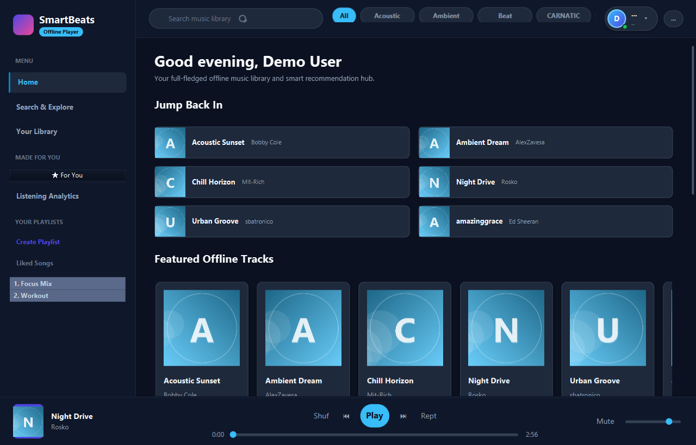
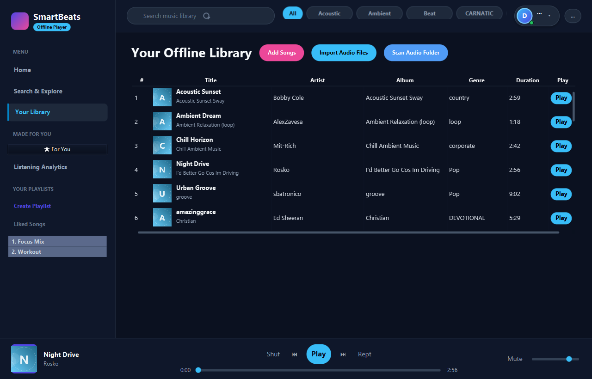
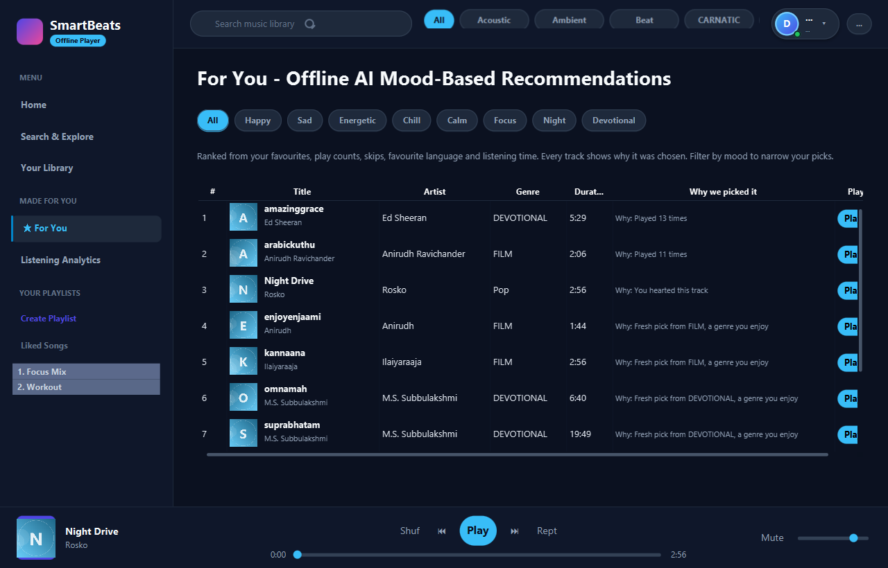
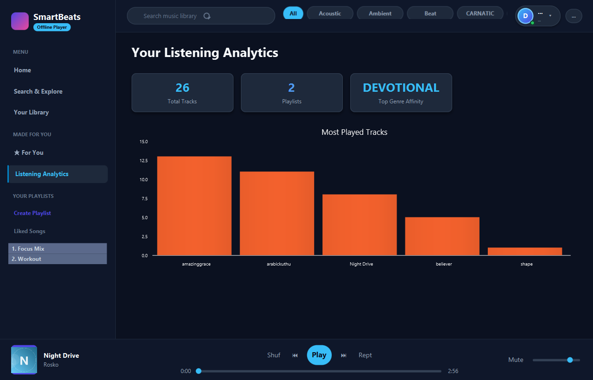
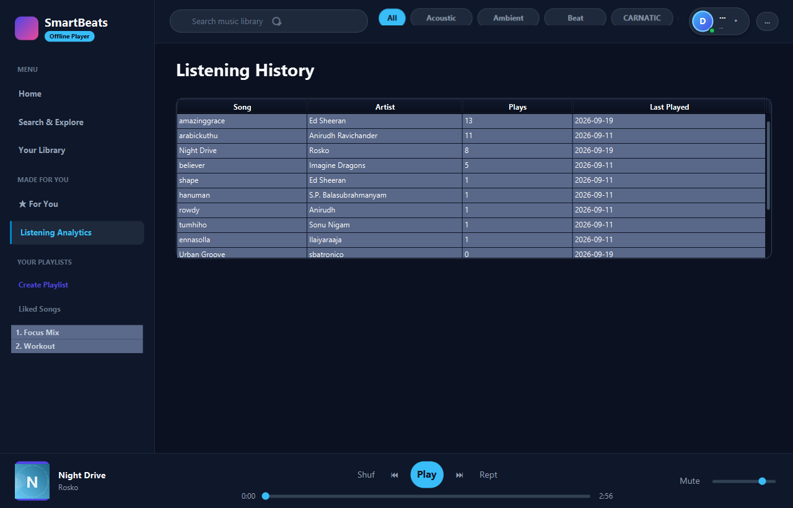
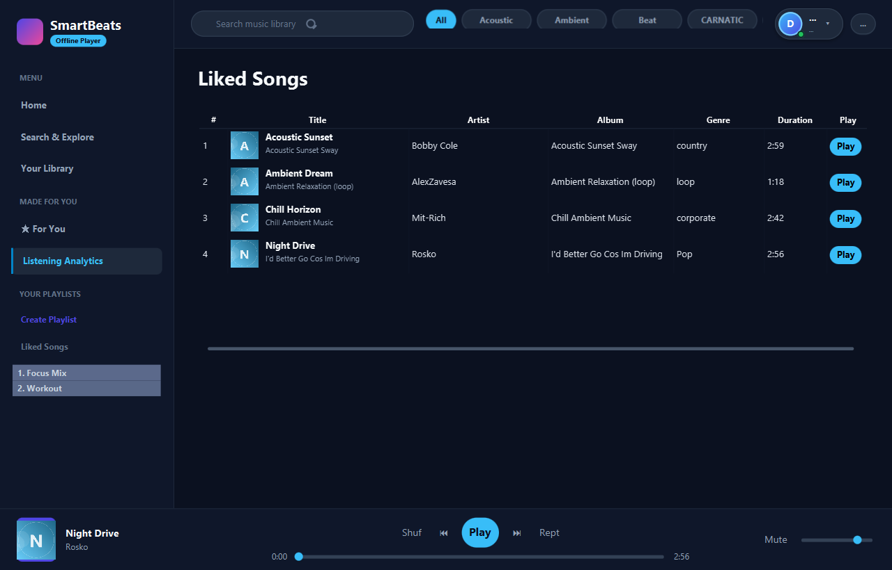

# SmartBeats — Intelligent Offline Music Player

**SmartBeats** is a fully offline desktop music library, player, and discovery
application built with **Java 17** and **JavaFX 21** (SQLite for storage). It
works with zero internet connection: no account servers, no cloud APIs, no
tracking — everything, including the recommendation engine, runs on your
machine.



## Features

- **Offline library** — bundled demo tracks plus "Add Songs", "Import Audio
  Files", and "Scan Audio Folder" for your own `.mp3` files.
- **Smart recommendations** — deterministic on-device scoring based on your own
  history, favourites, genres, artists, and languages, with a human-readable
  reason for every pick.
- **Safer accounts** — passwords stored as salted SHA-256 hashes; legacy
  plain-text passwords are upgraded automatically at login.
- **Per-user data** — history, favourites, playlists, and play counts are
  scoped per account.
- **Listening analytics** — total listening time on the Dashboard and a
  chronological listening log (History screen).
- **Full player** — play / pause / next / previous / seek / shuffle / repeat /
  volume, favourites, and a now-playing bar.
- **Playlists** — create, rename, delete, add/remove songs.
- **Dashboard & charts** — top genres, top songs, total plays, favourites, and
  listening time.

## Screenshots

| Home | Library | Recommendations |
|---|---|---|
|  |  |  |

| Dashboard | Listening History | Favourites |
|---|---|---|
|  |  |  |

## Requirements

- JDK 17+
- JavaFX 21 jars and dependencies bundled in `lib/` (sqlite-jdbc, JLayer,
  slf4j-nop) — no Maven/Gradle download needed.

## How to Run

1. Double-click **`run.bat`** (or run `run.ps1`) from the project folder.
2. Log in with **`demo-user` / `demo1234`** (or register a new account;
   pre-existing accounts with blank passwords also work).

Build manually:

```
javac -encoding UTF-8 -d target/classes --module-path lib \
  --add-modules javafx.controls,javafx.fxml,javafx.media,java.sql,java.desktop \
  -cp "lib/*" (all .java under src/main/java)
```

## Tests

Dependency-free automated suite in `src/test/java/com/musicplayer/test/TestRunner.java`
(no Maven/JUnit required). Run:

```
java --module-path lib --add-modules javafx.controls,javafx.fxml,javafx.media,java.sql,java.desktop \
     -cp "target/classes;target/test-classes;lib/*" com.musicplayer.test.TestRunner
```

Current result: **41 passed, 0 failed** (see `test-results.txt`).

## Project Structure

| Path | Contents |
|---|---|
| `src/main/java/com/musicplayer` | Application code (auth, dashboard, database, history, library, player, playlist, recommendation, utility) |
| `src/main/resources/fxml` + `css` | JavaFX UI screens and styling |
| `src/test/java` | Test suite |
| `src/probe` | Evidence/probe & screenshot-capture harnesses |
| `screenshots/` | Captured UI screenshots |
| `musicplayer.db` | Local SQLite database (with demo data) |
| `lib/` | Bundled dependency jars |

## Documentation

See [PROJECT_DOCUMENTATION.md](PROJECT_DOCUMENTATION.md) for architecture,
schema, the recommendation algorithm, and pitch strategy.